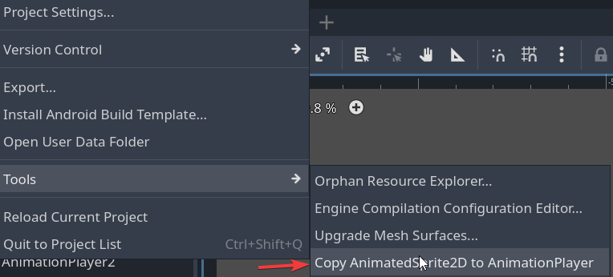

# AnimatedSprite2D to AnimationPlayer Copier

This Godot plugin allows you to easily copy animations from an AnimatedSprite2D node to an AnimationPlayer node. It's particularly useful when transitioning from sprite-based animations to more complex AnimationPlayer-driven animations.

## Features

- Automatically copies all animations from AnimatedSprite2D to AnimationPlayer
- Preserves frame timing and loop settings
- Creates a new AnimationLibrary named "SpriteAnimations" in the AnimationPlayer
- Works with Godot 4.x

## Installation

1. Clone this repository.
2. Copy the `addons/animation_copier` folder into your Godot project's `addons` folder.
3. Enable the plugin in your project:
   - Go to "Project" -> "Project Settings" -> "Plugins" tab
   - Find "Animation Copier" in the list and check the "Enable" box

## Usage

1. Make sure your scene contains both an AnimatedSprite2D (with animations) and an AnimationPlayer node.
2. Select the scene in the Godot editor.
3. In the top menu, go to "Project" -> "Tools" -> "Copy AnimatedSprite2D to AnimationPlayer".
4. The plugin will automatically find the first AnimatedSprite2D and AnimationPlayer in your scene and copy the animations.
5. Check your AnimationPlayer node. You should see a new AnimationLibrary named "SpriteAnimations" containing all the copied animations.

## Notes

- The plugin copies animations from the first AnimatedSprite2D and AnimationPlayer it finds in the current scene.
- Existing animations in the "SpriteAnimations" library will be overwritten.
- Make sure to save your scene after running the plugin to persist the changes.

## Troubleshooting

If you don't see the "Copy AnimatedSprite2D to AnimationPlayer" option in the Project menu:
1. Check if the plugin is enabled in Project Settings -> Plugins.
2. Try disabling and re-enabling the plugin, then restart Godot.

If animations are not copied correctly:
1. Ensure your AnimatedSprite2D has animations set up in its SpriteFrames.
2. Check the Output panel in Godot for any error messages from the plugin.

## Contributing

Contributions are welcome! Please feel free to submit a Pull Request.

## License

This plugin is distributed under the MIT license. See `LICENSE` file for more information.
